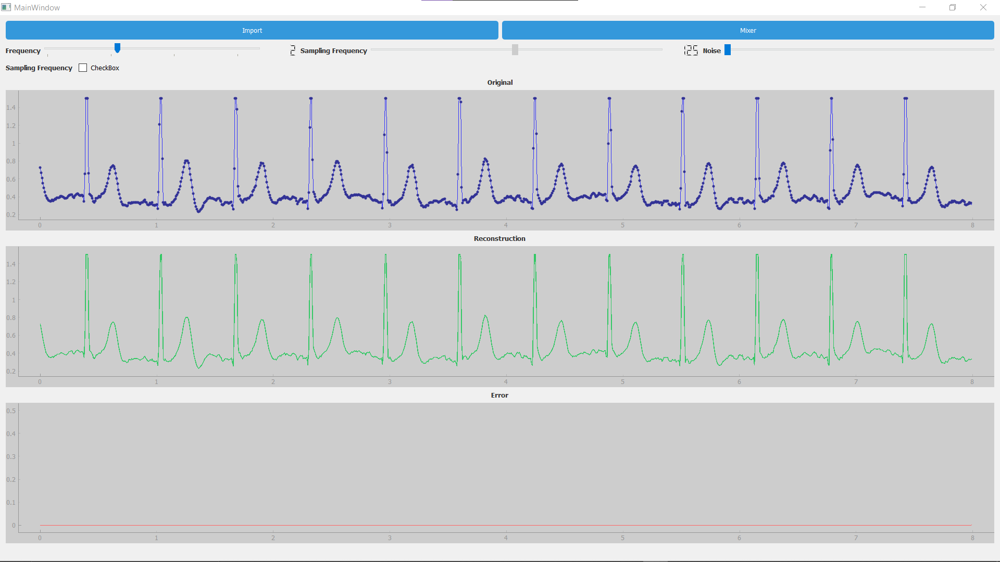
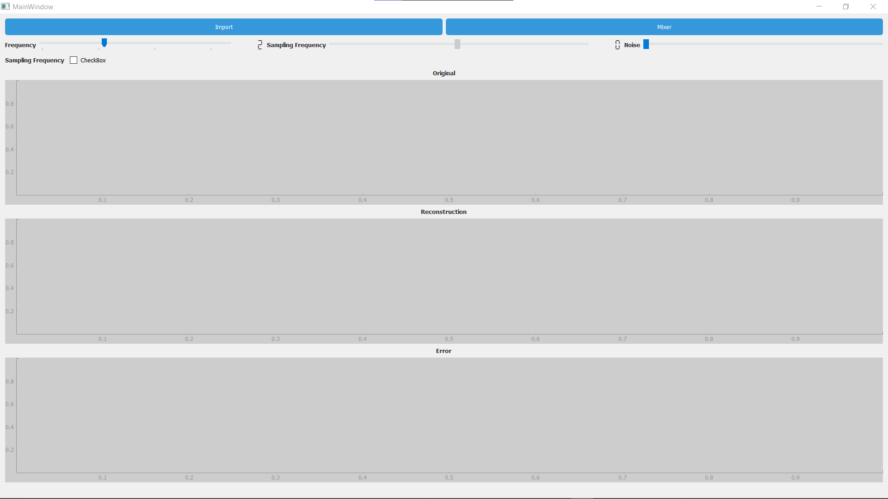
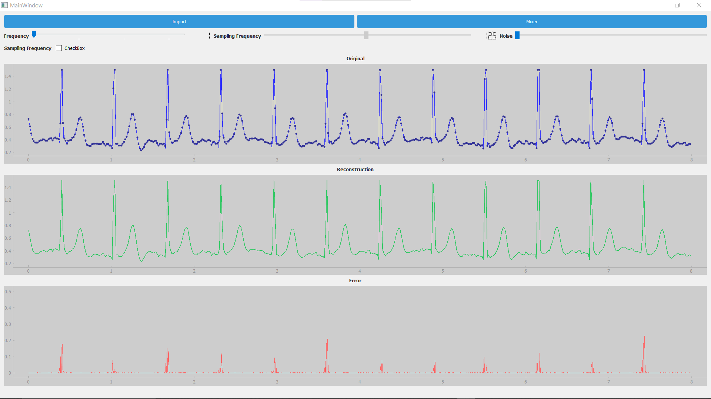
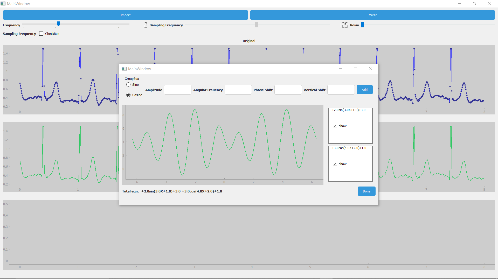
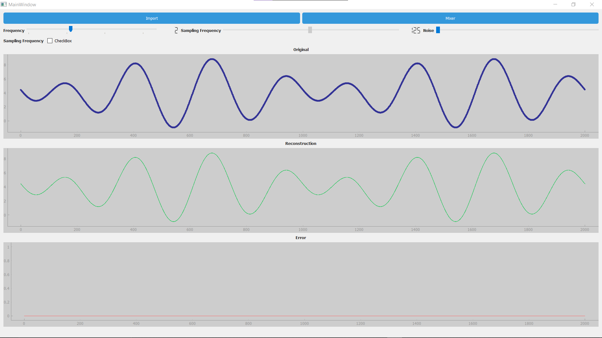

# Sampling Studio

## Features

1. Sampling by diffrent factors
2. Realtime plotting
3. Sampling by diffrent values
4. Reconstruction using Whittaker Shannon equation
5. Manual signal generatos

## Libraries

- PyQt5
- pyqtgraph
- pandas
- matplotlib
- scipy

## Preview

## Team Members

  
  
  
  

